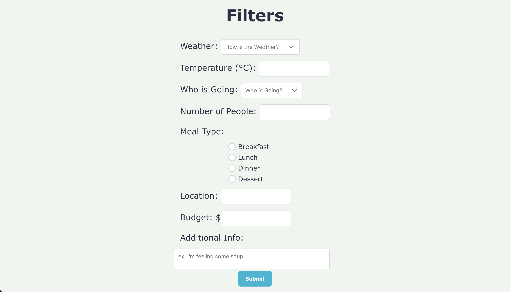
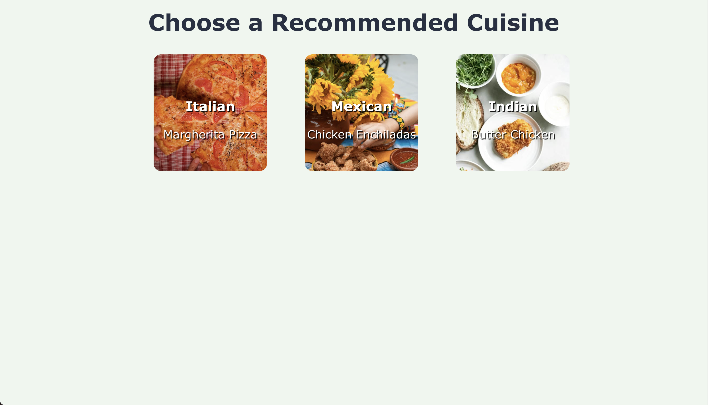
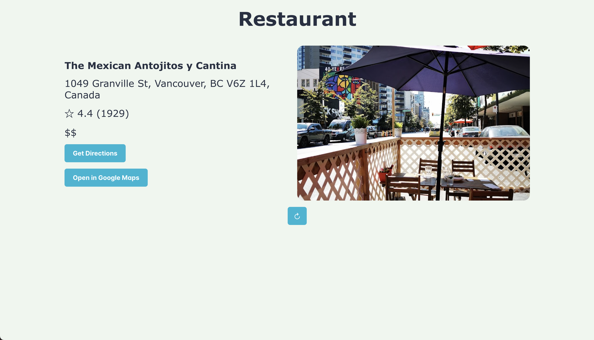
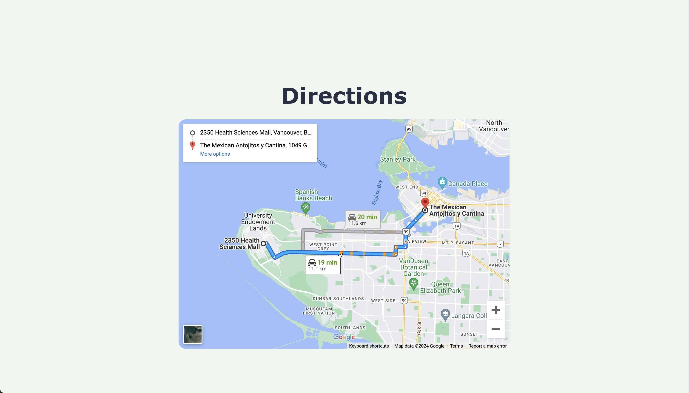

# Foodease

## Project Description

Does this scenario sound familiar: you are out with friends, family, or your significant other, and you simply CAN'T decide where to eat?
Foodease is a web app that aims to solve this issue! It relies on OpenAI API and Google Places API to do all the tedious decision-making for you.
All you have to do is this:

1. Input a handful of parameters to create a more personalized recommendation.
2. Choose one of the three cuisines generated by OpenAI API based on the criteria.
3. Receive a restaurant recommendation and either choose it or refresh for another similar suggestion.
4. Get the directions to the restaurant with a simple click of a button.

## Images

